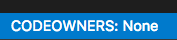
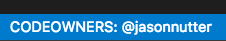
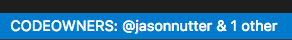
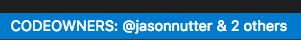
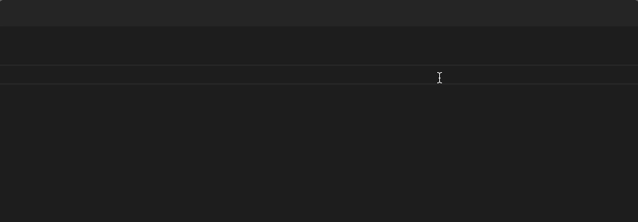

# vscode-codeowners

VS Code extension to display the code owners for the current file, as defined in the [CODEOWNERS](https://help.github.com/articles/about-codeowners/) file.

## Features

### Status bar

The first code owners for an open file will be displayed in the right side of the status bar. Clicking the status bar item will open a menu displaying all of the code owners.

### Command

Use the command palette to run the `CODEOWNERS: Show owners of current file` command, which will display all code owners for the current file.
